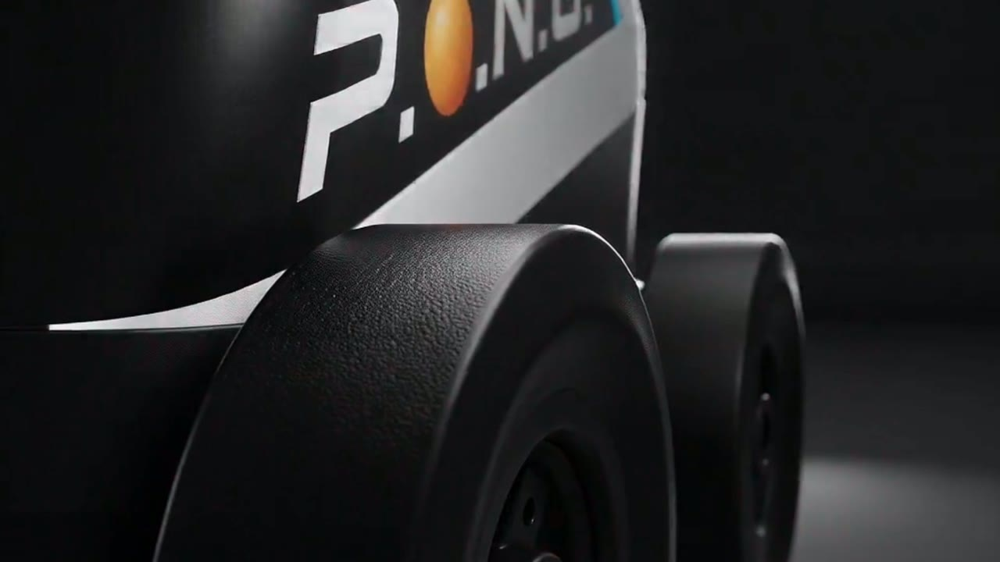

# LeRobot 机械臂动态抓取平台

基于 [LeRobot](https://github.com/huggingface/lerobot) 与 SO101 机械臂二次开发的**动态捡球抓取平台**。包含从底层硬件配置、安全防护控制、数据集采集清洗，到自动化夹取检测、情绪联动与评估的端到端全流程。

本仓库为 **SUES-Embodied-intelligence-GroupB** 的项目代码与数据集归档。

---

## 🎬 项目演示视频


上方为自动播放的无声预览（完整 62 秒流程）。点击下方封面，在浏览器中直接播放 **完整演示视频（含声音，720p 流畅版）**：

[](https://raw.githubusercontent.com/currygallagher87-ship-it/SUES-Embodied-intelligence-GroupB/main/media/SUES_720p.mp4)

- 🎞 在线播放版：[`media/SUES_720p.mp4`](https://raw.githubusercontent.com/currygallagher87-ship-it/SUES-Embodied-intelligence-GroupB/main/media/SUES_720p.mp4)（720p，8MB，点击即看）
- 📥 高清原片：[`media/SUES.mp4`](https://raw.githubusercontent.com/currygallagher87-ship-it/SUES-Embodied-intelligence-GroupB/main/media/SUES.mp4)（1080p，44MB，原始画质下载）

---

## 仓库内容

| 目录 / 文件 | 说明 |
|---|---|
| `media/` | **项目演示视频**：`SUES_720p.mp4`（在线播放版）、`SUES.mp4`（1080p 原片）、`SUES_preview.gif`（README 自动播放预览）、`SUES_poster.jpg`（封面） |
| `src/lerobot/` | LeRobot 核心代码库（含二次开发修改） |
| `datasets/lerobot_data_220/` | **训练用数据集**（220 条动态抓取轨迹，1.5GB） |
| `auto/` | 手动轨迹录制与回放工具 |
| `tools/grasp/` | 夹取工作流：`grasp_debug.py` 姿态标定、`eval_with_grasp_detect.py` 带夹取检测的评估、`emotion_display.py` 情绪联动服务、`place_pose.json` 标定数据 |
| `tools/arm/` | 机械臂安全调试与硬件工具：`relax_arm.py`、`default_pose.py`、`auto_pose.py`、`auto_find_limits.py`、`read_safe_pose.py`、`scan.py`、`find_cam.py`、`fix_id_5.py`、`fix_arm_port.sh` |
| `tools/dataset/` | 数据集清洗工具：`delete_episode.py`、`check_corruptions.py`、`fix_dataset_59.py` |
| `LeRobot_使用说明.md` | 完整详细使用手册 |

---

## 环境依赖与硬件准备

### 软件安装

项目基于 Python 3.10+ 和 PyTorch。进入项目根目录执行：

```bash
# 基础安装
pip install -e .

# Feetech (飞特) 舵机支持
pip install -e ".[feetech]"

# 情绪展示依赖
pip install opencv-python numpy Pillow
```

### 硬件串口绑定

Linux 下 USB 串口可能变动，使用脚本固定端口名：

```bash
sudo bash tools/arm/fix_arm_port.sh
```

### 硬件连通性测试

```bash
python tools/arm/scan.py      # 扫描舵机（确保 1~6 号关节在线）
python tools/arm/find_cam.py  # 列出可用摄像头 ID
```

---

## 数据集

训练数据集位于 `datasets/lerobot_data_220/`，包含 220 条动态抓取轨迹，目录结构：

```
datasets/lerobot_data_220/
├── data/           # Parquet 表格数据（关节状态、时间戳等）
├── meta/           # 元数据（episodes.jsonl 等）
└── videos/         # MP4 视频（front 摄像头 + handeye 摄像头）
```

### 数据集清洗工具

采集后如需筛选或修复，可使用以下脚本：

| 脚本 | 用途 |
|---|---|
| `python tools/dataset/check_corruptions.py` | 批量筛查时间戳倒退或异常的 episode |
| `python tools/dataset/delete_episode.py <idx>` | 精准删除坏数据，自动修正元数据 |
| `python tools/dataset/fix_dataset_59.py` | 修复/移除指定 episode 并修正元数据（一次性修复脚本） |
| `filter_dataset.py` | 截取前 N 条数据提纯 |
| `merge_dataset.py` | 将新采集数据无缝拼接到已有数据集 |

---

## 模型训练

数据集准备完毕后，使用 ACT (Action Chunking with Transformers) 微调训练：

```bash
python -m lerobot.scripts.train \
  --policy.path=<预训练模型路径> \
  --dataset.repo_id=lerobot_data_220 \
  --dataset.root=<仓库绝对路径>/datasets \
  --dataset.image_transforms.enable=true \
  --policy.use_amp=true \
  --policy.optimizer_lr=2e-6 \
  --policy.optimizer_lr_backbone=1e-6 \
  --batch_size=64 \
  --steps=80000 \
  --num_workers=4 \
  --save_freq=10000 \
  --output_dir=outputs/train/act_finetune_model
```

> **注意**：若 OOM 可降低 `batch_size`，`use_amp=true` 能大幅降低显存占用。

---

## 核心工作流：夹取姿态标定与自动化评估

本次升级的核心功能是**让机器人知道自己什么时候完成了任务，并给出情绪反馈自动停止**，需要三个脚本配合：

### 步骤一：标定目标姿态

```bash
python tools/grasp/grasp_debug.py
```

启动后卸载力矩 → 手动拖动机械臂到"放球/夹取成功"位置 → 按 Enter 保存 → 自动写入 `tools/grasp/place_pose.json`。

### 步骤二：启动情绪联动服务

```bash
# 新开终端，常驻后台
python tools/grasp/emotion_display.py
```

以 0.5s 频率轮询 `/tmp/robot_emotion.txt`，根据 `search` / `grab` / `success` / `sleep` 等状态切换 GIF 动画。

### 步骤三：带夹取检测的自动化推理

```bash
python tools/grasp/eval_with_grasp_detect.py
```

自动化工作逻辑：

1. 加载 `tools/grasp/place_pose.json`，连接摄像头、机械臂、加载 ACT 模型
2. 开场发送 `grab` 指令，情绪系统显示"抓取中"
3. 实时将当前关节位置与目标位置对比，6 关节误差全部 < `POSE_TOLERANCE`（默认 20 步）时计数
4. **Debounce 机制**：误差连续保持 `POSE_MATCH_FRAMES`（默认 15 帧，约 0.5s）才确认放球姿态
5. **缓冲延时**：确认后等待 `AFTER_PLACE_WAIT_S`（默认 3.7s），让模型完成"松夹爪 + 抬手臂"的连贯收尾
6. 打印成功信息 → 发送 `success` 指令 → 安全断开硬件 → 自动退出

---

## 机械臂安全调试

调试机械臂非常危险，项目中包含底层安全控制工具：

| 脚本 | 功能 |
|---|---|
| `python tools/arm/relax_arm.py` | 一键卸载所有关节力矩，机械臂瞬间无力瘫软 |
| `python tools/arm/read_safe_pose.py` | 读取当前各关节坐标数值 |
| `python tools/arm/default_pose.py` | 极度安全的缓慢归位（加速度锁死、运行时间 5s） |
| `python tools/arm/auto_pose.py` | 同上，自动化归位 |
| `python tools/arm/auto_find_limits.py` | 超低速度盲探物理极限，自动总结安全范围 |

---

## 手动轨迹录制与回放

如果不需要视觉模型，可以使用死记硬背的轨迹工具：

```bash
# 录制：自动卸载力矩，10Hz 记录关节轨迹，60s 后保存为 trajectory.json
python auto/record_trajectory.py

# 回放：安全归位 → 移动到第一帧 → 10Hz 精确还原 → 结束后安全收回
python auto/play_trajectory.py
```

---

## 开源协议

本项目基于 [Apache License 2.0](LICENSE)，继承自 [huggingface/lerobot](https://github.com/huggingface/lerobot)。
